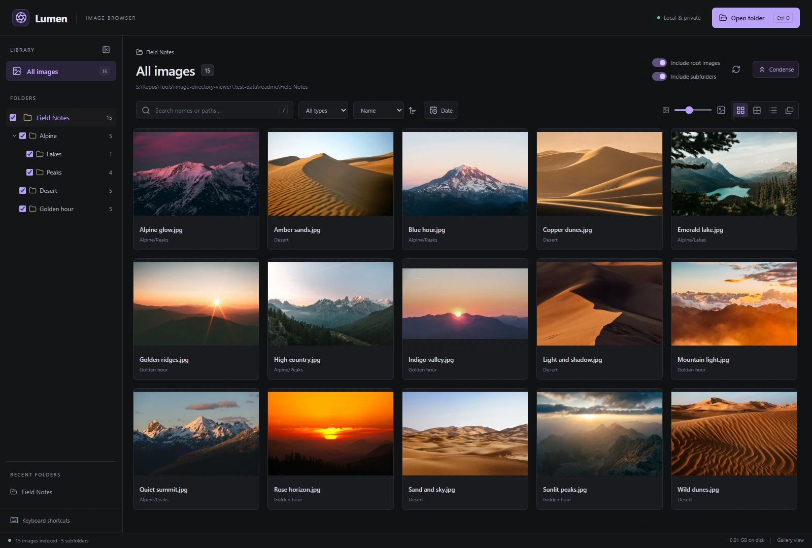
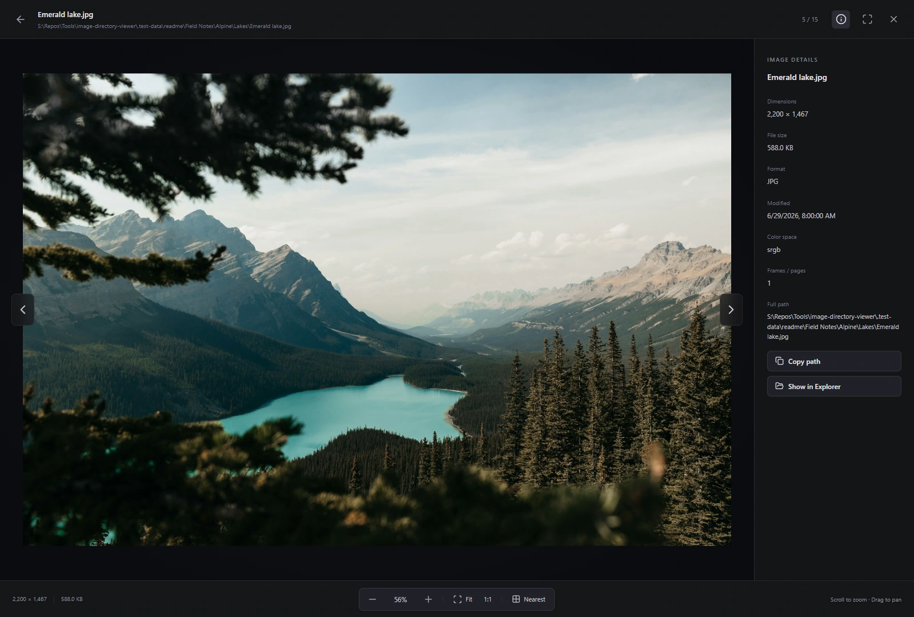
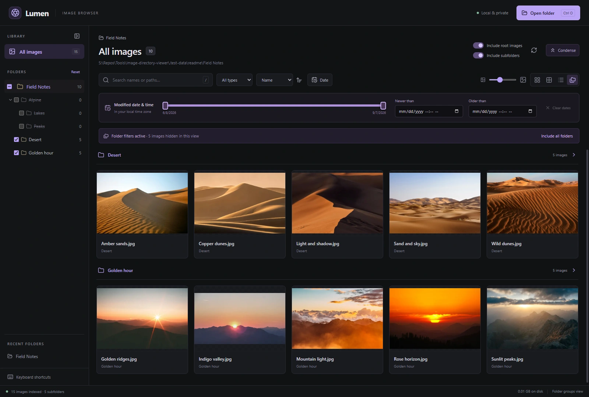
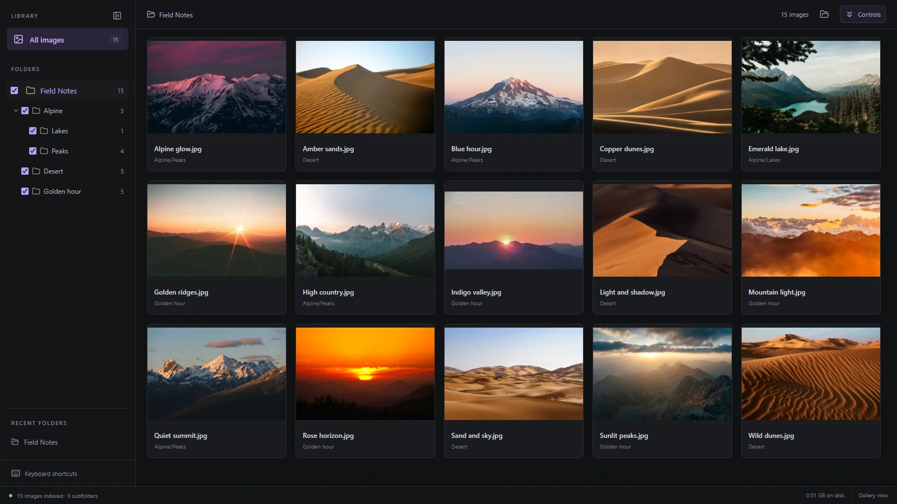

# Lumen

A fast, dark desktop image browser for local folders. Open a folder or drop it into the window to explore its images and all nested folders. No uploads or accounts; your original files stay untouched.

[](docs/screenshots/gallery.webp)

_One folder, every image. Browse a whole collection with adjustable thumbnails and a folder tree that keeps everything within reach._

**[Get started](#run-on-windows)** · **[Take a closer look](#a-closer-look)** · **[Browsing guide](#browsing)** · **[Keyboard shortcuts](#keyboard-shortcuts)**

| Explore                                                               | Focus                                                                                                | Inspect                                                                                              |
| --------------------------------------------------------------------- | ---------------------------------------------------------------------------------------------------- | ---------------------------------------------------------------------------------------------------- |
| Browse nested folders in Gallery, Compact, Details, or grouped views. | Combine search, file types, date ranges, and folder checkboxes. Condense the controls for more room. | Open originals, zoom and pan, check image details, and use nearest-neighbor rendering for pixel art. |

## A closer look

### Room for the image

Open an original and let it fill the window. Scroll to zoom, drag to pan, or switch between **Fit** and **1:1**. The details panel puts dimensions, format, and the full file path alongside the photo.

[](docs/screenshots/viewer.webp)

| Find your focus                                                                                                                                                   | Give your collection more space                                                                                                         |
| ----------------------------------------------------------------------------------------------------------------------------------------------------------------- | --------------------------------------------------------------------------------------------------------------------------------------- |
| [](docs/screenshots/folders-and-dates.webp) | [](docs/screenshots/condensed.webp) |
| Group images by folder, exclude a branch with one checkbox, and narrow the timeline with the date controls.                                                       | Hit **Condense** to tuck away the header and filters. Your folder tree and current collection remain close at hand.                     |

_Click any screenshot for the full-size capture. [Photo credits and screenshot recipe](docs/screenshots/README.md)._

## Run on Windows

Download [Lumen for Windows x64](https://github.com/JamesIV4/image-directory-viewer/releases/latest) and launch `Lumen-1.0.0-x64.exe`. The portable executable requires no installation or Node.js. It stores preferences and disposable caches in your Windows application data directory; your original images are never modified.

The first launch of each build extracts its runtime once. Later launches reuse that cache for faster startup (about 315 ms in the [local startup measurements](docs/startup-performance.md)). Runtime files are cached in `%LOCALAPPDATA%\Lumen\runtime`; you can remove this folder while Lumen is closed to reclaim space, and the next launch will recreate the required files.

To run from source, install Node.js 24 LTS, then run:

```powershell
npm.cmd ci
npm.cmd run build
npm.cmd start
```

Development with live updates:

```powershell
npm.cmd run dev
```

Lumen reopens your last folder at startup and restores its browsing settings. A startup folder argument overrides the remembered folder:

```powershell
npm.cmd start -- --folder="S:\Photos"
```

## Browsing

### View from your phone or another computer

Open the [Lumen Remote PWA](https://jamesiv4.github.io/image-directory-viewer/) in current Chrome or Edge. In the desktop app, open your image folder and click **Share on network**. Sharing starts automatically; if you previously stopped it, click **Start sharing**. The PWA finds Lumen automatically using `lumen.local`, connects without entering a pairing key, and retries when the PC becomes available again. Allow local-network access when prompted. If your network blocks mDNS discovery, expand **Connect using a PC address** and enter the displayed PC address; the key can be left blank. Both devices must be on the same Wi-Fi/LAN, and Lumen must stay open. If Windows prompts for firewall access, allow Lumen on **private networks**. No port forwarding is needed.

The PWA uses the same collection interface and image viewer as the desktop app, with a responsive layout for phones. It includes all four layouts, thumbnail sizing, sorting, filename/path search, file-type and date filters, folder patterns and inclusion controls, keyboard shortcuts, image metadata, fullscreen, zoom/pan, Fit, actual size, and nearest-neighbor rendering. Filters are independent on each device. Refresh rescans the PC library; changes on the PC appear automatically. **Open folder** opens a folder browser on your device showing the PC's folders. Browse drives, your home folder, recent locations, or enter a PC folder path and choose **Select this folder**; this switches the host library for all connected devices. Recent folders also switch the host library, and **Show in Explorer** reveals the image on your PC. **Copy path** uses your device's clipboard (requires a secure browser context); sharing settings and local folder drops are managed on the PC. Pages hosts only the interface; image requests go directly to your PC. While sharing is enabled, devices on the LAN can obtain the pairing key automatically and use these host controls. The five-character pairing key persists across PC restarts. Automatic discovery is intended for one sharing PC per network. The PWA remembers the address and key and reconnects when reopened; **Disconnect** forgets that connection and pauses discovery until you click **Find Lumen automatically** or reopen the PWA. **Stop sharing** disconnects clients. Lumen remembers your sharing on/off choice across restarts. Both the desktop host and PWA must be updated to use the shared interface.

To save an image, open it and tap **Save image** in the top bar or details pane. **Save or share** opens the device share sheet when file sharing is supported; choose its save-to-photos option when available. **Download image** saves the full-size file, and **Open image** lets you touch and hold it or use the browser's share menu to save to your camera roll. Available camera-roll options depend on the device and browser; native file sharing requires a secure context. Formats converted for viewing (TIFF, SVG, HEIC/HEIF) are saved as full-size PNGs.

Use the browser's install menu or the **Install** button, when offered, to add the HTTPS PWA to your home screen. Its interface works offline; viewing images requires your PC to be reachable. Photos and library responses are never stored in the PWA's offline cache. Sharing uses HTTP on port `47831`, so use a trusted private network. Browsers that block HTTPS-to-LAN HTTP requests, including unsupported mobile browsers, can browse by opening the displayed PC address directly; that HTTP page is a browser fallback, not an installable PWA. Guest Wi-Fi isolation, VPN routing, denied network permissions, and firewall rules can prevent connection. The original desktop releases predating this feature need to be replaced with a build containing it.

`npm.cmd run build:pwa` produces the standalone site in `dist-pwa/` and a copy for the desktop server in `dist/remote/`. The [Pages workflow](.github/workflows/pages.yml) builds, tests the sharing API, and deploys the static PWA on pushes to `main` or manual runs. GitHub Pages must use **GitHub Actions** as its publishing source.

- **All images** shows the entire recursively indexed collection. The folder tree filters to any branch; **Include subfolders** switches between that branch and just the selected folder's files.
- **Gallery**, **Compact**, **Details**, and **Grouped by folder** views share the same search and filters. Adjust thumbnail size with the slider.
- Search filenames and relative paths, filter by extension, and sort by name, path, modified date, or file size in either direction.
- Click **Date** to filter by **Newer than**, **Older than**, or both. Each field accepts a local date and time, and filters the file's modified timestamp (not the camera capture date). The boundaries are strict: files exactly at a specified threshold are excluded. **Clear dates** removes both limits; an invalid range shows a message. Date filters work with all collection views and folder filters and survive a refresh.
- The inline date-range bar spans the oldest to newest modified timestamps among images matching the current folder, search, and file-type scope. Drag either end to filter live; the date inputs stay synchronized. Hover anywhere on the bar to see its date/time, or focus a handle and use the arrow keys. Slider ranges include their selected boundaries; moving both handles back to the outer ends restores the full time range. The time scale remains fixed while dragging.
- Click **Condense** in the collection header to replace the app header, toolbar, date panel, and folder-filter banner with a single compact bar. Your current folder, visible image count, and active-filter badge remain visible, while all filters stay applied. Hover the badge for the filter summary; click it or **Controls** to expand again. The layout preference is remembered. Ctrl+F or / expands the controls and focuses search.
- Follow the clickable breadcrumbs to move up the folder structure. Relative paths appear on cards, and the full image path appears in the viewer and its details panel.
- Use the checkbox beside any folder to quickly include or exclude that whole branch. Excluded folders stay in the tree so they are easy to restore. You can include an individual subfolder inside an excluded parent; partially included branches show a mixed checkbox. Changing a parent's checkbox applies to its whole subtree. Counts in the tree reflect included images. **Include all folders** clears the folder filters. Checkbox filters are remembered separately for each root folder, including across restarts. Original files and the index are unaffected.
- **Include folders** and **Exclude folders** accept comma-separated folder names or glob patterns, for example `Photos, Screenshots` and `**/Cache, Thumbnails`. Names match at any depth; use `./Photos` to match only the branch directly under the opened root. Patterns support `*`, `**`, `?`, character ranges such as `[1-3]`, and alternatives such as `{Photos,Scans}`. Matching branches include their descendants. An empty Include field allows every folder; a nonempty one limits the view to matching branches, including hiding root images unless you include `.`. Exclusions take precedence, and checkbox filters still apply. Matching ignores case and accepts either slash style. Both fields apply live, update folder counts, and are remembered across refreshes, folders, and app restarts. **Include all folders** clears both fields and the checkbox filters.
- Turn off **Include root images** to hide photos directly in the root while keeping subfolder photos. When browsing a subfolder, **Include folder images** does the same for that folder's direct images. Subfolder inclusion is controlled separately.
- Drag the sidebar's right edge to resize it; its width is remembered. Double-click the edge to reset, or focus the divider and use Left/Right, Home, or End.
- Right-click an image in any view for **Open image**, **Reveal in File Explorer**, **Copy image path**, **Browse this folder**, **Exclude images in this folder** (direct images only), or **Exclude folder and subfolders**. The context-menu key or Shift+F10 also opens these actions. All exclusion actions filter the view without changing files.
- Click an image to open the original. Use the arrows to navigate the current filtered collection, scroll/pinch to zoom, and drag to pan. **Fit** fits the whole image without enlarging small images; **1:1** uses one image pixel per CSS pixel.
- On a touch screen, swipe a fitted image left for the next image or right for the previous image. Swipe up or down to return to the collection. Zooming in keeps single-finger panning; pinch zoom still works. Swipe inward from the left screen edge to go back, or from the right edge to go forward, including in the collection and mobile folder picker.
- Wheel zoom changes by about 12% of the current zoom for a standard 120-pixel wheel tick. Small trackpad deltas make proportionally smaller changes.
- **Nearest** toggles nearest-neighbor rendering above 100% zoom for pixel art and close inspection. At 100% and below, images use smooth rendering. The preference persists across images and app restarts.
- **Image details** includes dimensions, format, color space, size, and full path. Copy the path or show the image in Explorer.
- Use **Refresh** after adding, editing, moving, or deleting files. Refresh preserves your folder, search, and filters. Recent folders make reopening collections easy.
- Desktop and mobile reopen the last library and remember its selected subfolder, search, file type, folder patterns and checkboxes, direct-image and subfolder inclusion, date bounds, sort field and direction, view, thumbnail size, and condensed controls. Settings are saved per root folder and independently on each device; mobile settings are also scoped to the paired PC. Reopening a remembered library on mobile switches the PC's shared library for connected devices, just like **Open folder**.

## Keyboard shortcuts

| Action                          | Shortcut     |
| ------------------------------- | ------------ |
| Open folder                     | Ctrl+O       |
| Search                          | Ctrl+F or /  |
| Refresh index                   | F5           |
| Select images in the collection | Arrow keys   |
| Open selected image             | Enter        |
| Previous / next image in viewer | Left / Right |
| Close viewer or dialog          | Esc          |
| Zoom in / out                   | + / -        |
| Fit image                       | F or 0       |
| Actual size                     | 1            |
| Image details                   | I            |
| Nearest-neighbor toggle         | N            |
| Shortcut reference              | ?            |

## Formats and limits

JPEG (JPG/JPEG/JPE), PNG, WebP, GIF, AVIF, TIFF, SVG, and BMP are indexed. GIF and supported WebP animations play when viewing originals; thumbnails use the first frame. TIFF previews show the first page. SVGs are rasterized for viewing.

HEIC/HEIF files are also indexed, but decoding depends on the codec support in the installed Sharp/libvips build. The prebuilt decoder does not guarantee HEVC support. Camera RAW, PSD, and ICO are not currently supported. Damaged, missing, or unsupported images show an unavailable state without preventing the rest of the collection from loading.

Directory links and junctions are skipped to avoid cycles and traversal outside the chosen folder. Unreadable folders appear in indexing notices. Images over roughly 268 megapixels are rejected by the preview decoder; BMP decoding has a 100-megapixel limit. Native original image viewing remains subject to Chromium's memory and decoder limits. Very large originals can use considerable memory.

## Performance and architecture

- Electron provides native folder selection, local file access, clipboard, and Explorer integration. The isolated renderer runs React and TypeScript.
- A Node worker enumerates directories and runs up to 32 file-stat calls at a time, streaming results while scanning. Indexing reads file metadata rather than decoding images.
- Cached indexes appear when reopening a folder, then a fresh scan reconciles changed and removed files. Index snapshots are stored per root; they are caches rather than a live filesystem watcher.
- [TanStack Virtual](https://tanstack.com/virtual/latest/docs/introduction) renders visible rows with a small buffer. Both the image collection and folder tree are virtualized.
- [Sharp](https://sharp.pixelplumbing.com/) generates orientation-correct, aspect-preserving WebP thumbnails only when requested. Four decoding jobs run at a time, with shared requests deduplicated. BMP decoding uses `bmp-js` in a separate worker.
- File path, size, and modification time identify cached images. Changed files get new thumbnail keys. Thumbnails live on disk across sessions; an oldest-first cleanup attempts a 2 GiB soft cap in the background after the window opens. Cleanup stops when image browsing begins, so it cannot interrupt image loading. A session can exceed the cap until a later idle launch. Index snapshots are separate from that cap.
- [react-zoom-pan-pinch](https://github.com/BetterTyped/react-zoom-pan-pinch) supplies cursor-centered wheel zoom, pinch gestures, and panning. Originals are loaded separately from thumbnail previews.
- The renderer accesses indexed image IDs through a custom protocol and a narrow preload API. Node integration is disabled, context isolation and sandboxing are enabled, and navigation and external windows are blocked.

The app performs no image uploads and has no account requirement. Collection metadata is kept in memory, so memory use scales with the number of indexed files even though rendered cards are bounded.

## Build and verify

```powershell
npm.cmd test          # Indexing, cache, orientation, TIFF/BMP decoding, error handling
npx.cmd playwright install chromium # Once, for the HTTPS PWA browser check
npm.cmd run test:e2e  # Build + real Electron UI and HTTPS PWA checks
npm.cmd run dist      # Windows x64 portable executable in release/
npm.cmd run pack      # Unpacked desktop application in release/
npm.cmd run benchmark:startup -- release/Lumen-1.0.0-x64.exe 6  # Launch-to-usable-window timing
```

The UI tests generate disposable fixtures in `.test-data/`, use a separate app profile, and save screenshots in `test-results/`. They check recursive filtering, breadcrumbs, all views, virtualized rendering, search, TIFF originals, zoom limits, nearest-neighbor toggling, corrupt files, refresh reconciliation, and an 800×600 window. Electron's native folder picker and actual hardware gestures should also be checked manually.

Use `npm.cmd run dist -- --publish never` to produce the uploadable `release/Lumen-<version>-x64.exe` and its `.sha256` checksum. This command includes the runtime-cache launcher; calling electron-builder directly produces its standard portable launcher instead. ZIP compression reduces first-launch extraction time at the cost of a larger download.

**Packaged build versions:** `dist` and `pack` automatically increment the patch number once per new Git commit (for example, `1.0.0` → `1.0.1`) and update both `package.json` and `package-lock.json`. Repeating either command for the same commit reuses its version, even if uncommitted files changed or packaging previously failed. Ordinary `build`, development, and test runs do not change the version. The ignored `.packaged-build.json` file remembers the last packaged commit and version for this checkout; keep it to preserve repeat-build detection. A fresh checkout without that file reserves a new patch version on its first packaged build. Packaging requires a Git checkout with at least one commit.

Source layout: `electron/` contains filesystem and native desktop services, `src/` contains the UI, and `tests/` contains backend and Electron integration tests.

The desktop icon uses Lumen's purple aperture mark. Edit `assets/icon.svg`, then run `npm.cmd run icons` to regenerate the checked-in PNG and multi-size Windows ICO. Both development windows and packaged executables use these assets. Windows packaging embeds the icon and app metadata while keeping code signing disabled. The aperture geometry comes from Lucide; its license is in `assets/lucide-LICENSE`.
